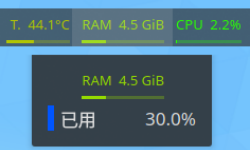
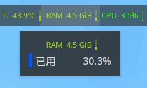

# Ksysguard Colored Text

## Overview 

This project provides a display style for Ksysguard, featuring basic data text and a bar graph that represents data percentages. The text and bars utilize gradient colors based on the data values.

Primarily designed as a sensor widget style for the **Plasma Panel**, this display style aims to offer users a clear and compact way to visualize sensor data. And this sensor style may not be suitable for use in system monitor.

## Installation

You can install this sensor face directly from the KDE Plasma System Monitor, or follow these steps:

1. Download the display style from the [releases](https://www.pling.com/p/1972690/) page or clone this repository.
2. Extract the downloaded file to `~/.local/share/ksysguard/sensorfaces/org.gerrnperl.text/`
3. Restart `Plasma shell` and `Plasma systemmonitors`.

## Screenshots

